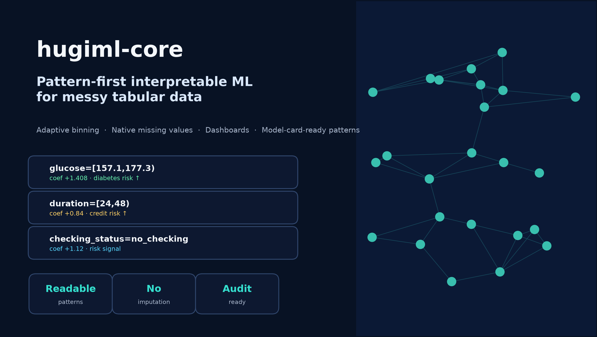
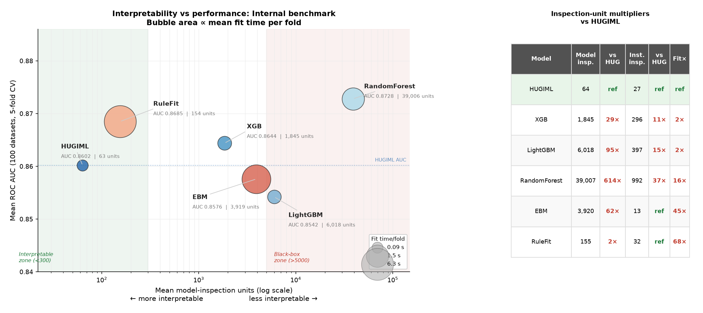
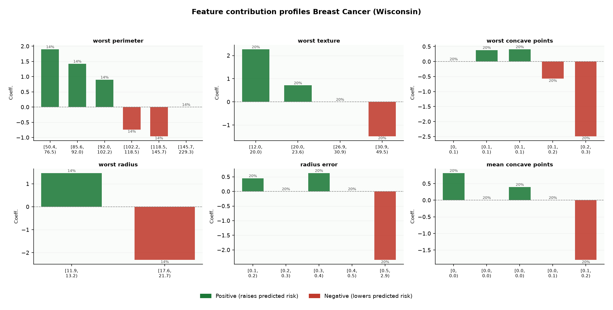
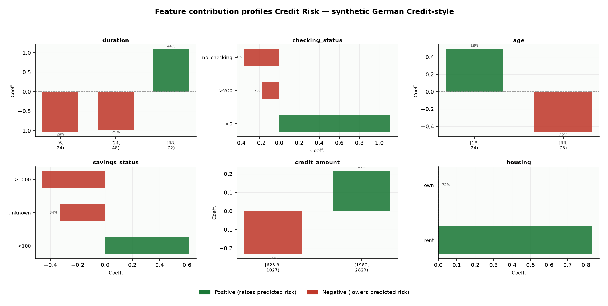
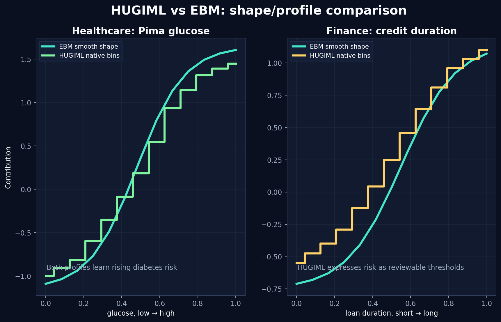
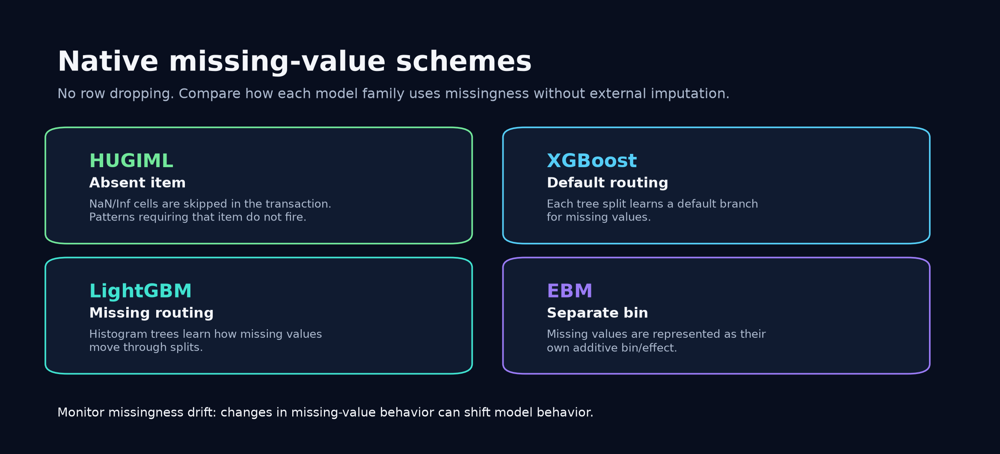
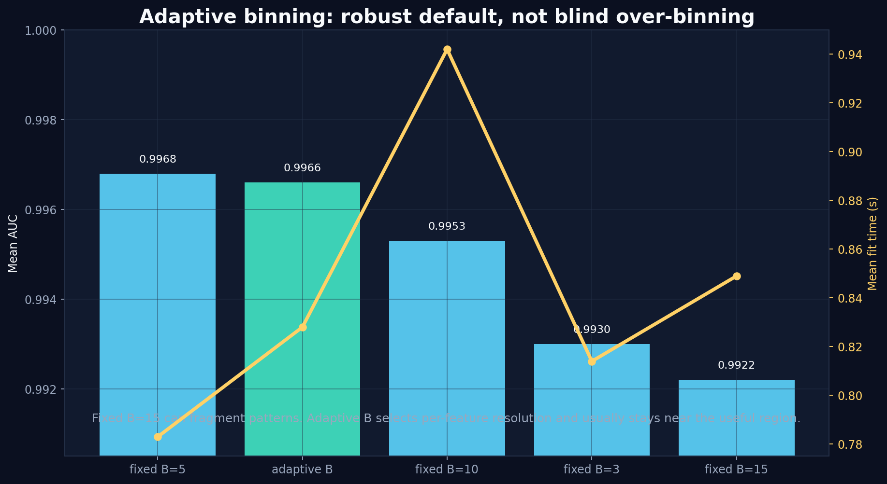
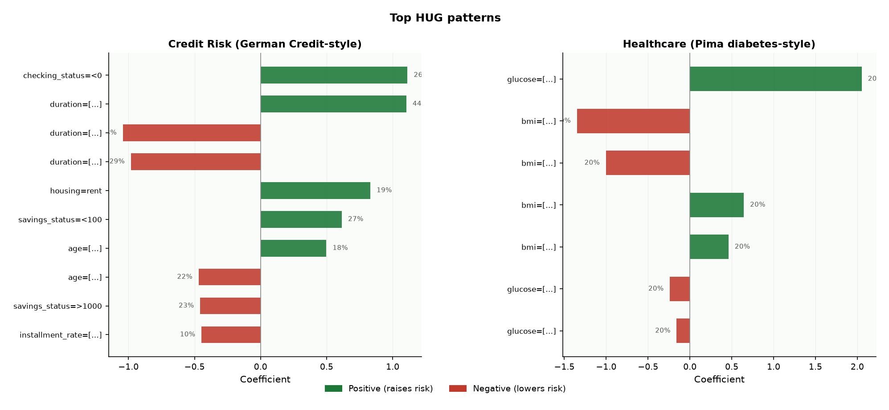
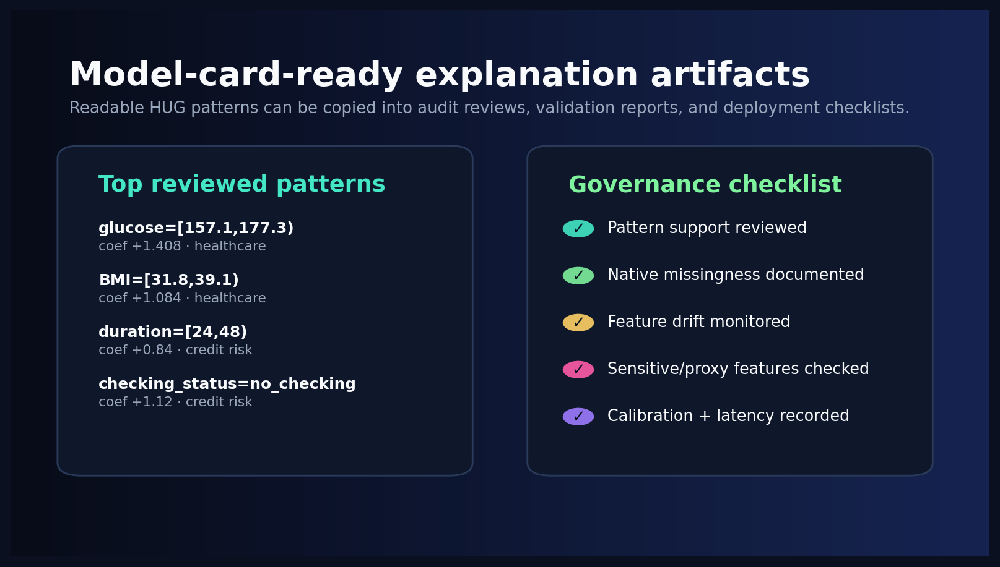

# hugiml-core

> **High-performance interpretable rule-based ML infrastructure** built on the
> HUG-IML algorithm published in IEEE Access (2024).

[](https://github.com/srikumar2050/hugiml-core/actions/workflows/ci.yml)
[](https://pypi.org/project/hugiml-core/)
[](https://hugiml-core.readthedocs.io/en/latest/?badge=latest)
[](https://pypi.org/project/hugiml-core/)
[](LICENSE)
[](https://doi.org/10.1109/ACCESS.2024.3455563)

<p align="left">
  
</p>

HUGIML learns **human-readable High Utility Gain patterns** and uses those patterns as the model representation itself. Instead of explaining a black-box after training, the learned model is already composed of inspectable intervals, categories, supports, utilities, and coefficients.

```text
glucose=[157.1,177.3)                coef= +1.4077   support=0.067
bmi=[31.8,39.1)                      coef= +1.0839   support=0.200
duration=[24,48)                     coef= +0.84     support=0.28
checking_status=no_checking          coef= +1.12     support=0.39
```

<p align="left">
  
</p>

---

## Table of Contents

1. [What Is HUG-IML?](#what-is-hug-iml)
2. [Installation](#installation)
3. [Quick Start](#quick-start)
4. [Feature Modes](#feature-modes)
5. [Execution Modes](#execution-modes)
6. [Hyperparameter Search](#hyperparameter-search)
7. [Governance Studio Dashboard](#governance-studio-dashboard)
8. [Augmented Pair Features](#augmented-pair-features)
9. [Adaptive Binning](#adaptive-binning)
10. [Missing Value Handling](#missing-value-handling)
11. [Model Explanation and Visualisations](#model-explanation-and-visualisations)
12. [Pattern Pruning](#pattern-pruning)
13. [Interpretability Metrics](#interpretability-metrics)
14. [Multiclass, Imbalanced Data, High-Cardinality](#multiclass-imbalanced-data-high-cardinality)
15. [Drift Detection & Monitoring](#drift-detection--monitoring)
16. [Calibration](#calibration)
17. [Serialisation](#serialisation)
18. [Governance & Model Cards](#governance--model-cards)
19. [Benchmark Suite](#benchmark-suite)
20. [Validation Highlights](#validation-highlights)
21. [Inference Server](#inference-server)
22. [CI / CD](#ci--cd)
23. [Repository Structure](#repository-structure)
24. [License](#license)
25. [Citation](#citation)

---

## What Is HUG-IML?

The **High Utility Gain Interpretable Machine Learning (HUG-IML)** framework extracts *High Utility Gain patterns* from labelled tabular data, transforms the input into a binary pattern-presence matrix, and fits an interpretable downstream classifier (logistic regression by default) on that matrix.

The resulting patterns are human-readable and serve as the primary source of model explanations, making the system suitable for regulated domains such as credit scoring, healthcare, and risk management.

**Key reference:**

> Krishnamoorthy, S. (2024). Interpretable Classifier Models for Decision
> Support Using High Utility Gain Patterns. *IEEE Access*, 12, 126088–126107.
> DOI: [10.1109/ACCESS.2024.3455563](https://doi.org/10.1109/ACCESS.2024.3455563)

---

## Installation

```bash
# Core
pip install hugiml-core

# With profile plots
pip install "hugiml-core[plots]"

# With Governance Studio dashboard
pip install "hugiml-core[dashboard]"

# With benchmark comparison suite
pip install "hugiml-core[benchmarks]"

# With imbalanced-data helpers
pip install "hugiml-core[imbalanced]"

# With SHAP interoperability
pip install "hugiml-core[explainability]"

# With MLflow integration
pip install "hugiml-core[mlflow]"

# Everything
pip install "hugiml-core[all]"
```

**Build from source** requires a C++17 compiler and pybind11:

```bash
git clone https://github.com/srikumar2050/hugiml-core.git
cd hugiml-core
pip install -e ".[dev]"
python setup.py build_ext --inplace
```

---

## Quick Start

`HUGIMLClassifier` is the primary public class name. `HUGIMLClassifierNative` remains available as a backward-compatible alias for existing code.

> **Note on `prepareXy`:** `prepareXy` performs schema and type preparation
> only — it detects integer, float, and categorical columns and encodes the
> target. Discretisation, HUG pattern mining, and downstream classifier fitting
> occur inside `fit()` on the training data supplied to that call.

### Path A — `prepareXy`

```python
import pandas as pd
from sklearn.model_selection import train_test_split
from hugiml import HUGIMLClassifier

clf = HUGIMLClassifier(adaptive_binning=True, L=1, G=5e-3, topK=100)

X_enc, y_enc = clf.prepareXy(X_df, y)   # schema/type prep — no model fitting

X_tr, X_te, y_tr, y_te = train_test_split(
    X_enc, y_enc, stratify=y_enc, random_state=42
)

clf.fit(X_tr, y_tr)                     # mining + downstream fit on train only
proba = clf.predict_proba(X_te)

print(clf.get_hug_features())
print(clf.feature_importances())
print(clf.model_summary())
```

### Path B — explicit `allCols` for CV and production pipelines

```python
from hugiml import HUGIMLClassifier

clf = HUGIMLClassifier(
    allCols=[int_col_names, float_col_names, cat_col_names],
    origColumns=X.columns.tolist(),
    B=-1,
    adaptive_binning=True,
    b_candidates=[2, 3, 5, 7, 10, 15],
    L=1,
    G=1e-5,
    topK=150,
)

clf.fit(X_train, y_train)

pred = clf.predict(X_test)
proba = clf.predict_proba(X_test)
```

---

## Feature Modes

HUGIML can use the mined binary pattern matrix in three downstream feature modes. The default remains pattern-only behavior, so existing code keeps the same high-interpretability semantics unless `feature_mode` is set explicitly.

| `feature_mode` | Downstream estimator input | When to use |
|---|---|---|
| `"patterns_only"` | HUGIML binary pattern matrix only | Standard HUGIML; best when the mined pattern space itself captures the decision boundary. |
| `"original_plus_patterns"` | Original features plus all mined binary patterns | Useful when original features contain strong marginal signal and HUGIML patterns add supervised nonlinear refinements. |
| `"original_plus_interactions"` | Original features plus only `L > 1` mined patterns | Useful when original features should handle marginal effects and HUGIML should contribute interaction/compound-region features only. |

The recommended tuning grid and configuration choices are described in [Hyperparameter Search](#hyperparameter-search). Start there for first-pass model selection, then select a representation based on interpretability and runtime needs.

```python
from hugiml import HUGIMLClassifier

# Backward-compatible default: pattern matrix only
clf = HUGIMLClassifier(B=-1, L=2, G=1e-2, topK=150,
                              adaptive_binning=True, feature_mode="patterns_only")

# Hybrid: original features + all binary HUGIML patterns
clf_hybrid = HUGIMLClassifier(B=-1, L=2, G=1e-2, topK=150,
                                    adaptive_binning=True, feature_mode="original_plus_patterns")

# Hybrid: original features + higher-order/interaction patterns only
clf_interactions = HUGIMLClassifier(B=-1, L=2, G=1e-2, topK=150,
                                          adaptive_binning=True,
                                          feature_mode="original_plus_interactions")
```

`transform(X)` always returns the HUGIML binary pattern matrix, regardless of `feature_mode`. The feature mode only changes the matrix passed to the downstream estimator inside `fit()`, `predict()`, `predict_proba()`, and `score()`.

For hybrid modes, HUGIML standardizes numeric original features internally before concatenating them with the sparse binary pattern matrix and any active augmented-pair columns. `feature_importances()`, `model_summary()`, and `get_model_composition()` report the downstream feature representation, while `get_hug_features()` and `get_pattern_info()` remain pattern-only APIs.

---

## Execution Modes

HUGIML supports two execution modes:

| `execution_mode` | Purpose | Behavior |
|---|---|---|
| `"audit"` | Default mode for development, validation, governance, and regulated review | Keeps the complete training and traceability artifacts needed by audit, governance, and dashboard APIs. |
| `"production"` | Lean mode for deployment after validation | Keeps prediction, probability scoring, save, and load behavior, while dropping training/audit-heavy artifacts to reduce retained memory. |

```python
from hugiml import HUGIMLClassifier

# Full traceability; this is the default.
audit_model = HUGIMLClassifier(execution_mode="audit")
audit_model.fit(X_train, y_train)

# Lean retained state for deployment.
prod_model = HUGIMLClassifier(execution_mode="production")
prod_model.fit(X_train, y_train)
prod_model.save_model("model.hugiml")
loaded = HUGIMLClassifier.load_model("model.hugiml")
```

In production mode, audit-oriented methods return a clear guidance result or raise a clear message asking you to refit with `execution_mode="audit"` when complete traceability is required.

---

## Hyperparameter Search

HUGIML provides a fast cached tuning path for adaptive-binning grids. When `adaptive_binning=True`, the binning and transaction construction work is reused across eligible candidates, so compact grids can be evaluated without rebuilding the same mining inputs repeatedly.

### Default recommended parameter grid

For a first tuning pass, use the built-in default recommended parameter grid. It is intentionally small: it keeps adaptive binning enabled, compares one-level and two-level pattern mining, compares pure pattern models with original-plus-pattern models, and varies the TopK feature budget.

```python
from hugiml import HUGIMLClassifier

grid = HUGIMLClassifier.default_param_grid()

# Equivalent explicit grid:
grid = {
    "B": [-1],
    "adaptive_binning": [True],
    "L": [1, 2],
    "feature_mode": ["patterns_only", "original_plus_patterns"],
    "topK": [30, 50, 100],
    "G": [1e-2],
}
```

| Parameter | Default recommended values | Purpose |
|---|---:|---|
| `B` | `[-1]` | Uses adaptive binning instead of a fixed global bin count. |
| `adaptive_binning` | `[True]` | Lets each numerical feature choose a supervised bin count. |
| `L` | `[1, 2]` | Compares single-feature patterns with pair/interaction patterns. |
| `feature_mode` | `patterns_only`, `original_plus_patterns` | Compares pure HUG pattern models with hybrid original-plus-pattern models. |
| `topK` | `[30, 50, 100]` | Controls the selected feature budget. |
| `G` | `[1e-2]` | Keeps the gain threshold fixed for a compact first pass. |

Use focused follow-up grids when you want to explore interaction-relaxed mining or augmented-pair transforms. Do not enable `interaction_relaxed_mining=True` and `augmented_pair_transforms=True` in the same `L >= 2` candidate.

### `tune()` — cross-validated search with automatic fast path

```python
result = HUGIMLClassifier.tune(
    X, y,
    param_grid=HUGIMLClassifier.default_param_grid(),
    cv=5,
    shuffle=True,
    random_state=42,
    scoring="roc_auc",
    refit=True,
)

print(result.best_params_)
print(f"CV score: {result.best_score_:.4f}")
print(f"Fast path used: {result.fast_path_used_}")

best_model = result.best_estimator_
```

A custom grid is supplied via `param_grid`. For the cached adaptive-binning path, keep the varying dimensions compact and centered on mining or representation choices such as `G`, `L`, `topK`, and `feature_mode`. Fixed values such as `B=-1` and `adaptive_binning=True` may be included for clarity.

```python
custom_grid = {
    "B": [-1],
    "adaptive_binning": [True],
    "G": [1e-2, 5e-3],
    "L": [1, 2],
    "topK": [50, 100],
    "feature_mode": ["patterns_only", "original_plus_patterns"],
}

result = HUGIMLClassifier.tune(
    X, y,
    param_grid=custom_grid,
    cv=3,
    scoring="roc_auc",
    refit=True,
)
```

### Choosing the model configuration

After the default grid identifies a useful budget range, choose one of these focused configurations based on the representation you want.

| Option | Feature mode | Interaction path | Extra downstream pair columns? | Interpretability | Runtime profile | Good default when... |
|---|---|---|---|---|---|---|
| Pure HUG patterns | `patterns_only` | Standard `L=1` or `L=2` mining | No | Very high | Lowest to moderate | You want the simplest pattern-only model. |
| Patterns + interaction-relaxed mining | `patterns_only` | `interaction_relaxed_mining=True` | No | Very high | Higher than augmented pairs | You want interaction evidence to affect HUG pattern discovery without adding a new feature family. |
| Patterns + augmented pairs | `patterns_only` | `augmented_pair_transforms=True` | Yes | High | Often faster than relaxed mining | You want selected pair evidence with better runtime control. |
| Originals + patterns | `original_plus_patterns` | Standard `L=1` or `L=2` mining | No | High | Moderate | Original variables have strong marginal signal and patterns add readable refinements. |
| Originals + patterns + relaxed mining | `original_plus_patterns` | `interaction_relaxed_mining=True` | No | High | Higher than augmented pairs | You want original features plus survivor-led HUG patterns, but no pair-operator columns. |
| Originals + patterns + augmented pairs | `original_plus_patterns` | `augmented_pair_transforms=True` | Yes | Moderate | Moderate to higher | You want the highest representation capacity among the recommended options. |

A **survivor** is a source feature that remains after interaction-information screening. It may not be one of the strongest features by itself, but it has useful pairwise or synergy evidence with another feature. In interaction-relaxed mining, these survivor source features are allowed to participate in native HUG pattern mining. A survivor is not automatically a final model feature; it is a candidate source that can help form mined patterns.

`interaction_relaxed_mining=True` relaxes the usual entry path for interaction-useful source features. Instead of adding product, difference, or sum columns to the downstream estimator, it lets a small survivor pool enter the native mining step, so the final representation remains HUG patterns plus any original features selected by `feature_mode`.

Use these focused follow-up grids:

```python
# Pattern-only with interaction-relaxed mining.
patterns_relaxed_grid = {
    "B": [-1],
    "adaptive_binning": [True],
    "L": [2],
    "G": [1e-2, 5e-3],
    "topK": [50, 100],
    "feature_mode": ["patterns_only"],
    "augmented_pair_transforms": [False],
    "interaction_relaxed_mining": [True],
    "interaction_relaxed_feature_size": [8, 12],
}

# Pattern-only with augmented pair features.
patterns_augmented_grid = {
    "B": [-1],
    "adaptive_binning": [True],
    "L": [2],
    "G": [1e-2, 5e-3],
    "topK": [50, 100],
    "feature_mode": ["patterns_only"],
    "augmented_pair_transforms": [True],
    "augmented_pair_mode": ["interaction_information"],
    "aug_feature_size": [8, 12],
}

# Originals plus patterns with interaction-relaxed mining.
originals_relaxed_grid = {
    "B": [-1],
    "adaptive_binning": [True],
    "L": [2],
    "G": [1e-2, 5e-3],
    "topK": [50, 100],
    "feature_mode": ["original_plus_patterns"],
    "augmented_pair_transforms": [False],
    "interaction_relaxed_mining": [True],
    "interaction_relaxed_feature_size": [8, 12],
}

# Originals plus patterns with augmented pair features.
originals_augmented_grid = {
    "B": [-1],
    "adaptive_binning": [True],
    "L": [2],
    "G": [1e-2, 5e-3],
    "topK": [50, 100],
    "feature_mode": ["original_plus_patterns"],
    "augmented_pair_transforms": [True],
    "augmented_pair_mode": ["interaction_information"],
    "aug_feature_size": [8, 12],
}
```

### `fast_grid_tune()` — single-split cached path for custom CV loops

```python
tune_result = HUGIMLClassifier.fast_grid_tune(
    X_train, y_train,
    X_val,   y_val,
    param_grid=HUGIMLClassifier.default_param_grid(),
    scoring="roc_auc",
    refit_full=False,
)

print(tune_result["best_params"])
print(f"Validation score: {tune_result['best_score']:.4f}")
```

---

## Governance Studio Dashboard

The **HUGIML Governance Studio** is an interactive Streamlit dashboard for preparing model runs, comparing candidate models, reviewing model evidence, and producing governance-ready summaries. It keeps the existing Workbench/Governance layout and exposes evidence views for adaptive binning, interaction-relaxed mining, augmented pairs, feature families, pattern coverage, monitoring, and validation review.

### Installation

```bash
pip install "hugiml-core[dashboard]"
```

The dashboard extra includes the UI and plotting dependencies used by the Governance Studio experience.

### Launch

```bash
# Installed console script
hugiml-dashboard

# Pass Streamlit or dashboard arguments after the separator
hugiml-dashboard -- --cv 5 --random-state 42

# Source-tree development
python -m streamlit run src/hugiml/dashboard/app.py
```

When installed, `hugiml-dashboard` starts the packaged Streamlit app automatically, so you do not need to know the source file location.

### What is included

| Area | What it supports |
|---|---|
| **Workbench** | Demo data or uploaded tabular data, target and column-role setup, candidate run configuration, model comparison, and drill-down review |
| **Governance** | Evidence summaries, validation results, representation review, adaptive-binning and augmented-pair evidence, feature-family review, pattern coverage, case-level explanations, data quality checks, policy review, monitoring signals, and model-card-oriented outputs |

### Evidence views

| View | What it shows |
|---|---|
| **Overview** | Dataset summary, active configuration, validation score, feature mode, and top evidence |
| **Validation** | Cross-validation metrics, fold-level results, and calibration-oriented review |
| **Representation Audit** | Original features, HUG patterns, augmented pairs, binary indicators, feature-family provenance, and complexity budget |
| **Pattern Inventory** | Pattern table with coefficients, support, utility, information gain, review filters, and population coverage |
| **Case Review** | Row-level predictions, probabilities, active pattern evidence, and explanation details |
| **Data Quality & Policy** | Missingness review, sensitive/proxy column checks, and policy-oriented notes |
| **Configuration Comparison** | Side-by-side comparison across HUGIML settings and optional baseline models |
| **Representation Pruning** | Interactive removal of original features or representation columns with re-evaluation |
| **Monitoring** | PSI and KL-divergence drift signals across fitted training baselines and review data |

### Data sources

- **Demo datasets** — built-in examples for dashboard exploration without uploading data.
- **Upload** — CSV, TSV, Excel (`.xlsx`/`.xls`), or Parquet files. The sidebar lets you choose the target, ID, protected/sensitive, date, numeric, categorical, and excluded columns before fitting.

### Binary indicators

Numeric two-value columns are treated as categorical indicators during HUGIML preparation, so encoded flags remain visible as discrete evidence in the dashboard instead of being shown as numeric intervals.

### Demo preview

- [Open the HUGIML Governance Studio Demo](https://srikumar2050.github.io/hugiml-core/hugiml_governance_studio_demo.html)

---

## Augmented Pair Features

For interaction-oriented models, HUGIML can add native augmented-pair features to the downstream estimator. These are continuous product or absolute-difference transforms built from informative numeric features, for example:

```text
glucose * bmi
abs(age - duration)
```

They are active when `L > 1`, `adaptive_binning=True`, and `augmented_pair_transforms=True` (the default). They are appended only to the downstream estimator; the mined HUG pattern matrix and `transform(X)` remain pattern-space APIs.

The default `augmented_pair_mode="interaction_information"` scores candidate source columns using pair context before building product, absolute-difference, sum, and signed-difference features. Set `augmented_pair_mode="marginal_ig"` to use the v1.1.11 marginal-information-gain source selection behavior. `aug_feature_size` controls how many source columns are retained in interaction-information mode; `ii_partner_size` optionally bounds partner search; `max_pair_features` controls the source budget for marginal-IG mode.

```python
clf = HUGIMLClassifier(
    B=-1,
    adaptive_binning=True,
    L=2,
    topK=50,
    G=1e-2,
    feature_mode="original_plus_patterns",
    augmented_pair_transforms=True,
    augmented_pair_mode="interaction_information",
    aug_feature_size=10,
    topk_budget_strict=True,
)
clf.fit(X_train, y_train)

print(clf.get_model_composition())
print(clf.explain_augmented_pair_effects())
```

For selected pair features, HUGIML reports the raw formula, standardized formula, observed-row coverage, missing-pair policy, and raw-scale coefficient interpretation.

---

## Adaptive Binning

The global `B` parameter controls how many quantile bins each numerical feature is discretised into. Adaptive binning selects the optimal bin count per feature via supervised information-gain search and elbow stopping.

```python
from hugiml.adaptive import HUGIMLAdaptive

clf = HUGIMLAdaptive(b_candidates=[3, 5, 7, 10, 15], L=2, G=1e-2)

X_enc, y_enc = clf.prepareXy(X_df, y)
clf.fit(X_tr, y_tr)

print(clf.per_feature_b_)
clf.plot_bin_profiles()
clf.ig_heatmap()
```

Alternatively, enable adaptive binning directly on `HUGIMLClassifier`:

```python
from hugiml import HUGIMLClassifier

clf = HUGIMLClassifier(
    adaptive_binning=True,
    b_candidates=[3, 5, 7, 10],
    min_marginal_gain_ratio=0.02,
)
```

**How it works:** for each numerical feature, HUGIML evaluates information gain at candidate `B` values and stops when the marginal gain falls below `min_marginal_gain_ratio × current_IG`. This prevents blindly selecting the maximum bin count.

---

## Missing Value Handling

HUGIML treats NaN and Inf values as **not observed** — no imputation and no special parameter are required.

**How it works:** numerical columns are pre-binned at fit time. Non-finite cells become `np.nan` in the label array, and the C++ transaction builder skips them. The corresponding item is absent from the transaction. Patterns requiring that feature do not fire for that row.

```python
import numpy as np
from hugiml import HUGIMLClassifier

X_train.iloc[5, 2] = np.nan

clf = HUGIMLClassifier(B=5, L=2, G=1e-4)
clf.fit(X_train, y_train)

X_test.iloc[0, 0] = np.nan
proba = clf.predict_proba(X_test)       # scored using available feature items
```

### Mining Patterns About Missingness

To mine patterns that involve missingness (e.g., `Glucose_MISSING=1 AND HeartRate=[110,140]`), add binary missingness indicators as preprocessing features:

```python
def add_missingness_indicators(X, threshold=0.05):
    X_aug = X.copy()
    for col in X.columns:
        if X[col].isna().mean() > threshold:
            X_aug[f"{col}__MISSING"] = X[col].isna().astype(int)
    return X_aug

X_with_indicators = add_missingness_indicators(X_raw)
clf = HUGIMLClassifier(B=7, L=2, G=1e-4)
clf.fit(X_with_indicators, y)
```

The Governance Studio **Data Quality & Policy** view shows feature-level missingness rates alongside sensitive column review.

---

## Model Explanation and Visualisations

### Interactive Plotly dashboard

```python
from hugiml.plots import HUGPlotter

plotter = HUGPlotter(clf)

plotter.plot_dashboard(
    X_test,
    dataset_name="My Dataset",
    feature_names_for_profile=["age", "income", "glucose"],
    output_path="hugiml_dashboard.html",
)

plotter.plot_marginal_bin_profile("glucose", X=X_test).show()
plotter.plot_top_patterns(top_n=20).show()
plotter.plot_feature_importance(top_n=15).show()
plotter.plot_active_patterns(X_test, sample_idx=0).show()
```

Each profile panel shows the learned bin/pattern behavior for a feature: utility or coefficient-like contribution per bin, with support overlay where available.

Existing example dashboards:

**Public tabular benchmark classification**


**Credit risk scoring**


- [Open the HUGIML Benchmark Analysis Dashboard](https://srikumar2050.github.io/hugiml-core/hugiml_benchmark_analysis_dashboard.html)

### Profile visualisations

```python
plotter.plot_marginal_bin_profile("age", X=X_test).show()  # EBM-style 1-D shape function
plotter.plot_feature_combinations("age").show()             # Feature-combination view
plotter.plot_top_patterns(top_n=20).show()                  # Top patterns by importance
plotter.plot_active_patterns(X_test, sample_idx=0).show()   # Local explanation for one sample
```

---

## Pattern Pruning

In regulated domains, analysts often need to remove patterns that reference protected attributes, have high PSI, or are operationally invalid. HUGIML provides a controlled editing workflow with a JSON audit trail.

```python
from hugiml.pruning import PatternEditor

editor = PatternEditor(clf, operator_name="risk-team")

print(editor.list_patterns().head(10))

editor.remove([3, 7], reason="references protected attribute 'gender'")
editor.remove_by_keyword("postcode", reason="high PSI — unstable feature")
editor.remove_low_support(min_support=0.01, reason="noise patterns")

editor.refit(X_tr, y_tr)
editor.calibrate(X_cal, y_cal, method="isotonic")

new_clf = editor.finalize()
print(editor.audit_report())
```

The **Representation Pruning** view in the Governance Studio provides an interactive version of this workflow without writing code.

---

## Interpretability Metrics

```python
from hugiml.metrics import compute_all_metrics

m = compute_all_metrics(clf, X_test)
print(m)
```

Example output:

```text
InterpretabilityMetrics
==========================================
n_patterns              : 87
avg_pattern_length       : 1.34
coverage                 : 0.9812
mean_active_patterns     : 6.21
overlap_rate             : 0.0714
explanation_sparsity     : 0.0230

top-k cumulative |coef|:
top- 1 : 8.4%
top- 5 : 31.2%
top-10 : 54.7%
```

---

## Multiclass, Imbalanced Data, High-Cardinality

### Multiclass Classification

```python
from hugiml.multiclass import MulticlassHUGReport

report = MulticlassHUGReport(clf)
print(report.importances_for_class(class_label=2, top_n=10))
print(report.summary())
```

### Imbalanced Data Handling

```python
from hugiml.multiclass import make_imbalanced_pipeline

clf_bal = make_imbalanced_pipeline(clf_proto, strategy="smote")
clf_bal.fit(X_tr, y_tr)
```

### High-Cardinality Categorical Reduction

When categorical features have hundreds or thousands of unique values (ZIP codes, ICD-10 diagnoses, merchant IDs), grouping rare categories prevents combinatorial explosion in pattern mining:

```python
def reduce_high_cardinality(X, y, threshold=50, min_frequency=0.01):
    """Group rare categories (<min_frequency) as '__OTHER__' for high-cardinality columns."""
    X_reduced = X.copy()
    for col in X.select_dtypes(include=["object", "category"]).columns:
        if X[col].nunique() <= threshold:
            continue
        value_counts = X[col].value_counts()
        min_count = len(X) * min_frequency
        rare_categories = value_counts[value_counts < min_count].index
        X_reduced[col] = X[col].apply(
            lambda x: "__OTHER__" if x in rare_categories else x
        )
    return X_reduced

X_reduced = reduce_high_cardinality(X_raw, y, threshold=50, min_frequency=0.01)
clf = HUGIMLClassifier(B=7, L=2, G=1e-4)
clf.fit(X_reduced, y)

# Or use built-in target encoding:
from hugiml.multiclass import encode_high_cardinality, apply_encoding
X_enc, enc_map = encode_high_cardinality(X_tr, y_tr, threshold=20, method="target_mean")
X_te_enc = apply_encoding(X_te, enc_map)
```

**Note:** Learn category groupings on training data only, then apply the same mapping to test/production data.

---

## Drift Detection & Monitoring

```python
clf.enable_monitoring(window_size=1000)

clf.predict_proba(X_new)

print(clf.monitor.report())

report = clf.detect_drift(X_new, current_labels=y_new)
print(report)
```

The **Monitoring** view in the Governance Studio shows PSI and KL-divergence drift signals per feature from the fitted model's training baseline.

---

## Calibration

```python
from hugiml.calibration import evaluate_calibration

result = evaluate_calibration(y_te.values, proba[:, 1])

print(f"ECE: {result.ece:.4f}")
print(f"Brier: {result.brier_score:.4f}")
```

---

## Serialisation

```python
from hugiml.serialization import save_model, load_model, generate_sbom

save_model(clf, "model.hugiml")
clf2 = load_model("model.hugiml")

sbom = generate_sbom(clf)
```

---

## Governance & Model Cards

```python
from hugiml.governance import generate_model_card

card = generate_model_card(
    clf,
    model_id="credit-scorer-v1.0.0",
    intended_use="Credit risk assessment for SME lending.",
    training_data_description="German Credit dataset, 1000 samples",
)

print(card.to_markdown())
card.save("model_card.json")
```

Model cards should include top positive/negative patterns, missing-value behavior, calibration metrics, drift-monitoring plan, and any pattern-pruning audit trail.

The **Governance Studio dashboard** provides interactive governance evidence views that complement programmatic model cards with visual audit artifacts.

---

## Benchmark Suite

Reproduce paper claims or benchmark on your own datasets:

```bash
# Run full CV comparison
python -m hugiml.benchmarks.runner

# Specific datasets
python -m hugiml.benchmarks.runner --datasets german_credit pima adult

# Save results
python -m hugiml.benchmarks.runner --output benchmarks/results/
```

Or use the installed console script:

```bash
hugiml-bench --datasets german_credit --output results/
```

### Scalability dashboard

For runtime and memory scaling evidence, see the static scalability dashboard:

- [Open the HUGIML Scalability Dashboard](https://srikumar2050.github.io/hugiml-core/hugiml_scalability_dashboard.html)

The dashboard summarizes measured fit time, prediction latency, memory delta, pattern counts, and test AUC against XGBoost and LightGBM. It covers sample-size scaling, feature-count scaling, and parameter sweeps over `B`, `G`, `topK`, `L`, and adaptive binning. HUGIML retains many training and test artifacts to support governance and audit requirements. 

Worked notebooks in [`notebooks/`](notebooks/) are organized as 12 self-contained folders:

| Folder | Notebook | Brief description |
|---|---|---|
| [`00_quickstart`](notebooks/00_quickstart/) | [`nb00_pattern_explanation_walkthrough.ipynb`](notebooks/00_quickstart/nb00_pattern_explanation_walkthrough.ipynb) | Quick end-to-end walkthrough of fitting HUGIML, extracting patterns, and reading pattern-level explanations. |
| [`01_benchmark_baselines`](notebooks/01_benchmark_baselines/) | [`nb01_benchmark_baselines.ipynb`](notebooks/01_benchmark_baselines/nb01_benchmark_baselines.ipynb) | Benchmark comparison across HUGIML and common tabular baselines such as XGBoost, LightGBM, Random Forest, and logistic regression. |
| [`02_hug_vs_ebm`](notebooks/02_hug_vs_ebm/) | [`nb02_hug_vs_ebm.ipynb`](notebooks/02_hug_vs_ebm/nb02_hug_vs_ebm.ipynb) | Side-by-side comparison of HUGIML pattern profiles and EBM-style additive shape functions. |
| [`03_modeling_special_cases`](notebooks/03_modeling_special_cases/) | [`nb03_modeling_special_cases.ipynb`](notebooks/03_modeling_special_cases/nb03_modeling_special_cases.ipynb) | Practical modeling cases including multiclass targets, imbalance, high-cardinality categoricals, adaptive binning, and pruning workflows. |
| [`04_credit_risk`](notebooks/04_credit_risk/) | [`nb04_credit_risk.ipynb`](notebooks/04_credit_risk/nb04_credit_risk.ipynb) | Credit-risk governance example using German Credit-style data, scorecard-style features, and auditable risk patterns. |
| [`05_aml`](notebooks/05_aml/) | [`nb05_aml.ipynb`](notebooks/05_aml/nb05_aml.ipynb) | Anti-money-laundering example focused on suspicious transaction pattern discovery and model review artifacts. |
| [`06_mobile_money`](notebooks/06_mobile_money/) | [`nb06_mobile_money_fraud.ipynb`](notebooks/06_mobile_money/nb06_mobile_money_fraud.ipynb) | Mobile-money fraud example showing compact transaction-risk patterns and operational fraud-review signals. |
| [`07_basel_ca`](notebooks/07_basel_ca/) | [`nb07_basel_ca.ipynb`](notebooks/07_basel_ca/nb07_basel_ca.ipynb) | Basel capital-adequacy oriented example for regulated risk analytics and explainable model validation. |
| [`08_clinical`](notebooks/08_clinical/) | [`nb08_healthcare_breast_cancer.ipynb`](notebooks/08_clinical/nb08_healthcare_breast_cancer.ipynb) | Clinical classification example using breast-cancer features to demonstrate interpretable healthcare pattern explanations. |
| [`09_insurance`](notebooks/09_insurance/) | [`nb09_insurance_underwriting.ipynb`](notebooks/09_insurance/nb09_insurance_underwriting.ipynb) | Insurance underwriting example with risk-selection patterns and model-card-friendly feature narratives. |
| [`10_medicare`](notebooks/10_medicare/) | [`nb10_medicare_program_integrity.ipynb`](notebooks/10_medicare/nb10_medicare_program_integrity.ipynb) | Medicare program-integrity example for suspicious provider/claim behavior and audit-ready pattern summaries. |
| [`11_workforce_analytics`](notebooks/11_workforce_analytics/) | [`nb11_workforce_attrition.ipynb`](notebooks/11_workforce_analytics/nb11_workforce_attrition.ipynb) | Workforce attrition analytics example showing HR risk patterns, explanation tables, and governance-oriented summaries. |

---

## Validation Highlights

> The finance panels use German Credit / HELOC-style risk features such as loan duration, credit amount, checking status, and repayment-risk signals. The healthcare panels use Pima diabetes-style features such as glucose, BMI, pregnancies, pedigree, and age.

### HUGIML vs EBM shape profiles

<p align="left">
  
</p>

EBM is excellent for smooth effect inspection; HUGIML is strong when the explanation needs to be reviewed as a set of readable thresholds and pattern contributions.

### Real-world and synthetic benchmarks

<p align="left">
  
</p>

<p align="left">
  
</p>

### Native missing-value handling

<p align="left">
  
</p>

| Model | Native missing-value behavior | What to monitor |
|---|---|---|
| **HUGIML** | Missing numerical values are absent from the transaction. Patterns requiring that feature item do not fire. | Missingness rate and activation frequency of top patterns. |
| **XGBoost** | Each split learns a default route for missing values. | Whether default-route behavior changes under deployment shift. |
| **LightGBM** | Histogram splits learn how missing values are routed. | Missing-value routing and feature missingness drift. |
| **EBM** | Missing values can be modeled as a separate bin/effect. | Size and sign of each missing-bin effect. |

### Adaptive binning

<p align="left">
  
</p>

Adaptive binning is a safe default when you do not want to tune `B`; fixed `B=5` is a useful fast baseline.

### Pattern explanations

<p align="left">
  
</p>

### Model-card-ready artifacts

<p align="left">
  
</p>

### Observed benchmark results


| Model | AUC (mean±std) | Fit time/fold | Complexity budget | Remarks |
|---|---:|---:|---|---|
| HUG B=3 | 0.9907 ± 0.0031 | 0.32 s | **topK** patterns | `topK` is an explicit cap; actual mined patterns can be lower. |
| HUG B=5 | 0.9909 ± 0.0028 | 0.34 s | **topK** patterns | More bins per feature. |
| HUG adaptive | 0.9954 ± 0.0022 | 1.20 s | **topK** patterns | Per-feature B increases fit time. |
| EBM | 0.9940 ± 0.0025 | 11.0 s | Additive terms + interactions | Reference interpretable baseline. |
| XGBoost | 0.9882 ± 0.0040 | 0.12 s | Trees × leaves | High-performing ensemble; not directly pattern-interpretable. |
| LightGBM | 0.9921 ± 0.0028 | 0.07 s | Leaves × trees | Fast histogram boosting. |

### Complexity budget

`topK` is the feature-selection budget **K**. It caps each selected feature family before the final estimator is built, unless `topk_budget_strict=True` is used to apply one global cap. The effective downstream width **D** can be lower than these limits when fewer valid features are mined or selected.

| Configuration | Downstream feature budget when `topK = K` |
|---|---|
| `patterns_only`, `L = 1` | Up to **K** HUG pattern features. |
| `patterns_only`, `L > 1`, `interaction_relaxed_mining=True` | Up to **K** HUG pattern features. The mining search may admit up to `interaction_relaxed_feature_size` interaction-information survivor source columns, but no extra downstream feature family is added. |
| `patterns_only`, `L > 1`, augmented pairs enabled | Up to **K** HUG pattern features + up to **K** augmented-pair features, so **D ≤ 2K**. |
| `original_plus_patterns`, `L = 1` | Up to **K** selected original features + up to **K** HUG pattern features, so **D ≤ 2K**. |
| `original_plus_patterns`, `L > 1`, `interaction_relaxed_mining=True` | Up to **K** selected original features + up to **K** HUG pattern features, so **D ≤ 2K**. Survivor-led mining affects which patterns are available, not the number of downstream feature families. |
| `original_plus_patterns`, `L > 1`, augmented pairs enabled | Up to **K** selected original features + up to **K** HUG pattern features + up to **K** augmented-pair features, so **D ≤ 3K**. |
| `original_plus_interactions` | Original features are capped at **K**; retained interaction/pattern features are also bounded by the HUG pattern budget. With augmented pairs enabled, the same additional **K** augmented-pair cap applies. |
| `topk_budget_strict=True` | HUGIML first avoids oversized family blocks, then applies one global TopK selection across the constructed original, pattern, and augmented-pair candidates, so final **D ≤ K**. |

#### Feature-family budgets

`topK` defines the per-family selection budget used by HUGIML when constructing downstream representations. A configuration may include one, two, or three selected feature families:

- HUG pattern features
- selected original input features
- augmented-pair features, when enabled for higher-order configurations

Interaction-relaxed mining changes the native search path but does not add a separate downstream feature family; its budget is `interaction_relaxed_feature_size`, which controls survivor-source admission before pattern mining.

Each active family can contribute up to `topK` downstream columns before strict global selection. Therefore, the maximum downstream width is the number of active selected families multiplied by `topK`:

- one active family: up to `topK` columns
- two active families: up to `2 × topK` columns
- three active families: up to `3 × topK` columns

For example, with `topK=150`, `original_plus_patterns` at `L=1` can retain up to `150` selected original columns and up to `150` HUG pattern columns, for a maximum downstream width of `300`. With `L>1` and `interaction_relaxed_mining=True`, the same downstream width bound remains `300`; the relaxed path affects pattern discovery rather than adding feature columns. With `L>1` and augmented-pair transforms enabled, the same configuration can retain up to `150` selected original columns, `150` HUG pattern columns, and `150` augmented-pair columns, for a maximum downstream width of `450`. When `topk_budget_strict=True`, HUGIML applies one final global TopK selection across the constructed downstream candidates, so the final downstream width is capped at `topK`.

With strict budgeting enabled, HUGIML applies the TopK budget during feature construction rather than after building a full expanded matrix. This keeps the practical downstream width bounded and avoids large intermediate matrices. In hybrid modes, original features are scored and preselected before prediction-time preparation, so prediction prepares only the retained original columns.

### Missing value robustness


---

## Capabilities Summary

| Capability | Details |
|---|---|
| **HUG pattern mining** | C++ accelerated via pybind11; optional OpenMP parallelism |
| **scikit-learn API** | Full `BaseEstimator` / `ClassifierMixin` compliance |
| **Mixed feature types** | Integer, float, categorical — auto-detected or explicitly supplied |
| **Feature modes** | Pattern-only, original-plus-patterns, original-plus-interactions, augmented-pair downstream features |
| **Fast hyperparameter search** | Cached adaptive-binning grid; mining runs once per unique `(G, L, topK)` group |
| **Governance Studio** | Multi-view Streamlit dashboard with audit evidence views and upload support |
| **Profile visualisations** | EBM-style 1-D/2-D HUG profiles, active-pattern explanations, coefficient-support views (Plotly) |
| **Interpretability metrics** | Pattern count, coverage, overlap, sparsity, top-k cumulative contribution |
| **Adaptive binning** | Per-feature supervised `B` selection — addresses the B-sensitivity trap |
| **Pattern pruning** | Regulated remove/refit/calibrate workflow with full JSON audit trail |
| **Multiclass & imbalance** | Multiclass report, SMOTE/class-weight pipeline, high-cardinality encoding |
| **Benchmark suite** | Reproducible CV comparison vs EBM, XGBoost, RF, LR, RuleFit, GAM |
| **Scalability dashboard** | Static runtime, latency, memory, n-scaling, p-scaling, and parameter-sweep evidence vs XGBoost and LightGBM |
| **Calibration** | ECE, MCE, Brier score, reliability diagram data |
| **Drift detection** | PSI + symmetric KL divergence + label drift |
| **Monitoring** | Thread-safe `PredictionMonitor`, latency tracking |
| **Governance** | Model cards (JSON + Markdown), audit artifacts, SBOM |
| **Observability** | OpenTelemetry tracing, Prometheus metrics (both optional) |
| **Secure serialisation** | Allowlist-based `_RestrictedUnpickler`, versioned schema |
| **Deployment** | FastAPI inference server, Docker image, Kubernetes manifests |
| **CI/CD** | GitHub Actions: lint → coverage → native tests → wheels → PyPI |

---

## Inference Server

A FastAPI-based inference server is included for containerised deployments.

```bash
docker build -t hugiml-core:latest -f docker/Dockerfile .

docker run -p 8080:8080 -v /path/to/models:/models hugiml-core:latest

curl -s -X POST http://localhost:8080/predict \
  -H "Content-Type: application/json" \
  -d '{"instances": [{"age": 35, "savings": "moderate"}]}'
```

Kubernetes manifests are in [`kubernetes/deployment.yaml`](kubernetes/deployment.yaml).

---

## CI / CD

| Workflow | Trigger | What it does |
|---|---|---|
| [`ci.yml`](.github/workflows/ci.yml) | Every push / PR | Lint, type-check, coverage gate, native tests, sanitizer build, benchmark regression, wheel build |
| [`release.yml`](.github/workflows/release.yml) | Git tag `v*.*.*` | Build platform wheels, generate SBOM, publish to PyPI, create GitHub release |

---

## Repository Structure

```text
hugiml-core/
├── src/
│   ├── _native/                 C++ extension sources
│   └── hugiml/
│       ├── classifier.py        HUGIMLClassifier / HUGIMLClassifierNative
│       ├── calibration.py       ECE, Brier, reliability diagrams
│       ├── explainability.py    SHAP bridge, feature lineage, stability
│       ├── governance.py        Model cards, audit artifacts
│       ├── monitoring.py        PredictionMonitor, DriftDetector
│       ├── serialization.py     save/load, SBOM, restricted unpickler
│       ├── telemetry.py         OpenTelemetry, Prometheus
│       ├── exceptions.py        Exception hierarchy
│       ├── metrics.py           Interpretability-complexity metrics
│       ├── plots.py             EBM-style profile visualisations
│       ├── pruning.py           Pattern editor + audit trail
│       ├── adaptive.py          Per-feature adaptive binning
│       ├── multiclass.py        Multiclass / imbalanced / encoding
│       ├── dashboard/           Governance Studio Streamlit application
│       │   ├── app.py           Entry point (hugiml-dashboard console script)
│       │   ├── runner.py        Model training and scoring helpers
│       │   ├── components/      Individual evidence-view renderers
│       │   └── ...
│       └── benchmarks/          CV comparison suite
├── notebooks/                   Worked examples (12 domain folders)
├── tests/                       Pytest suite
├── benchmarks/                  Micro-benchmarks and regression gate
├── docker/                      Dockerfile + FastAPI inference server
├── kubernetes/                  Deployment manifests
├── scripts/                     Build and utility scripts
├── docs/                        Sphinx documentation and model-card templates
├── .github/workflows/           CI/CD pipelines
├── pyproject.toml
└── setup.py
```

---

## License

Apache License 2.0 — see [LICENSE](LICENSE).

---

## Citation

If you use hugiml-core in research or commercial work, please cite:

```bibtex
@article{krishnamoorthy2026interpretability,
  title        = {Interpretability Myopia: Governance Fitness in Financial Risk Models},
  author       = {Krishnamoorthy, Srikumar},
  journal      = {SSRN Electronic Journal},
  year         = {2026},
  doi          = {10.2139/ssrn.6821418},
  url          = {https://dx.doi.org/10.2139/ssrn.6821418},
  keywords     = {Interpretable machine learning, analytics, financial risk governance, deployment evaluation, regulatory compliance, model risk management}
}

@article{krishnamoorthy2024hugIML,
  author  = {Krishnamoorthy, Srikumar},
  title   = {Interpretable Classifier Models for Decision Support Using High Utility Gain Patterns},
  journal = {IEEE Access},
  volume  = {12},
  pages   = {126088--126107},
  year    = {2024},
  doi     = {10.1109/ACCESS.2024.3455563}
}
```
