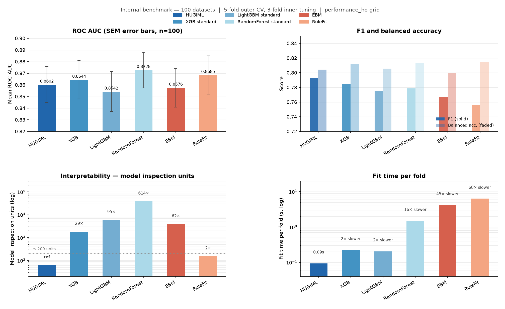
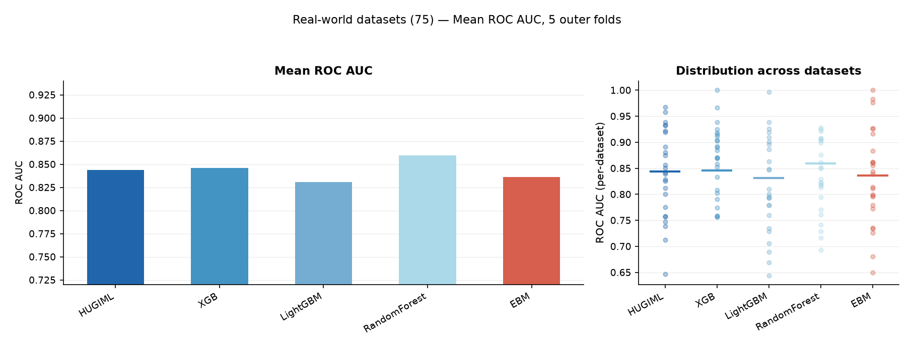
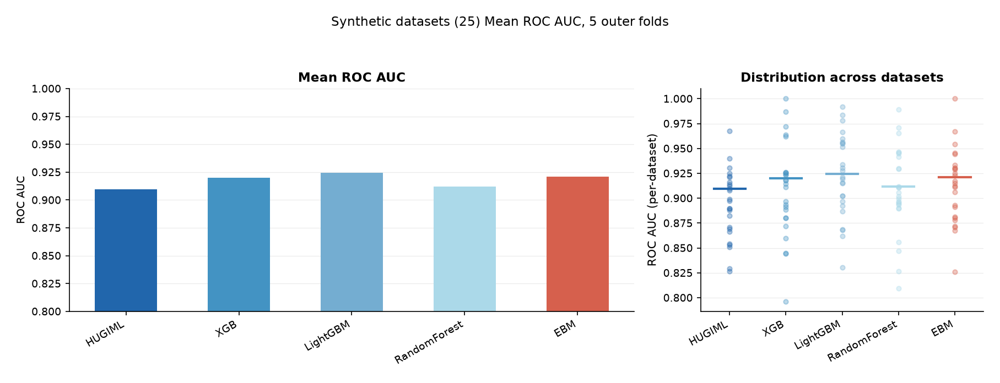
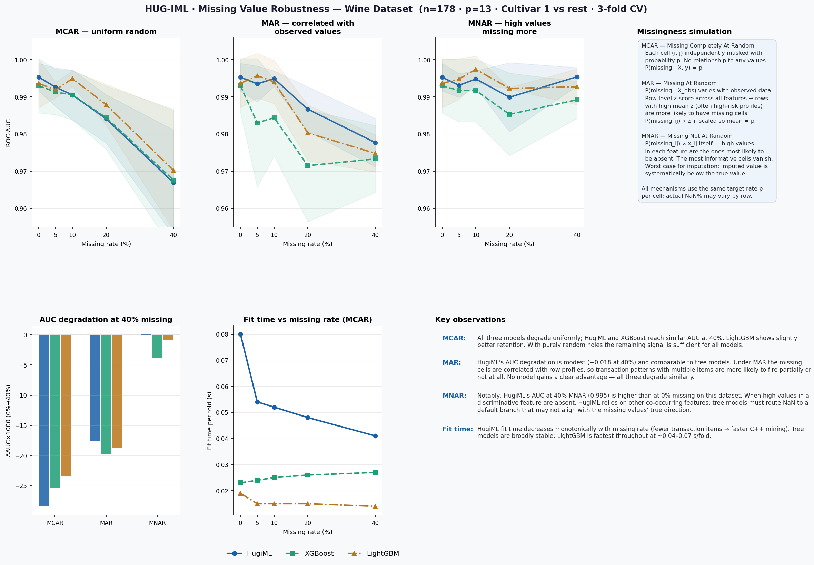

Benchmarks
==========

Benchmark runner
----------------

The benchmark runner compares HUGIML with common tabular baselines such as logistic regression, random forests, gradient boosting libraries, EBM, RuleFit, and GAMs when optional dependencies are installed.

.. code-block:: bash

   pip install "hugiml-core[benchmarks]"
   python -m hugiml.benchmarks.runner --datasets german_credit pima adult --output benchmarks/results/

or use the console script:

.. code-block:: bash

   hugiml-bench --datasets german_credit --output results/

Benchmark visuals
-----------------

Missing-value robustness
------------------------

Interpretation guidance
-----------------------

The benchmark suite should be read as a trade-off analysis, not as a universal ranking. Boosted tree models often deliver the highest raw predictive score, while HUGIML emphasizes compact pattern-level explanations, governance artifacts, and auditable behavior. For larger datasets, start with ``L=1`` and a bounded ``topK`` to keep mining and audit complexity manageable.

Reproducibility notes
---------------------

* Record dataset versions, preprocessing, train/test splits, and random seeds.
* Compare both mean and standard deviation across folds.
* Include complexity measures such as number of patterns, active patterns per prediction, fitted-feature count, and fit time.
* Use statistical tests or confidence intervals when differences are small.

